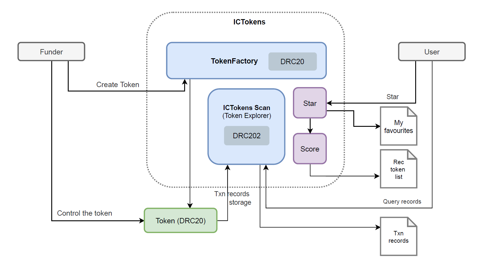
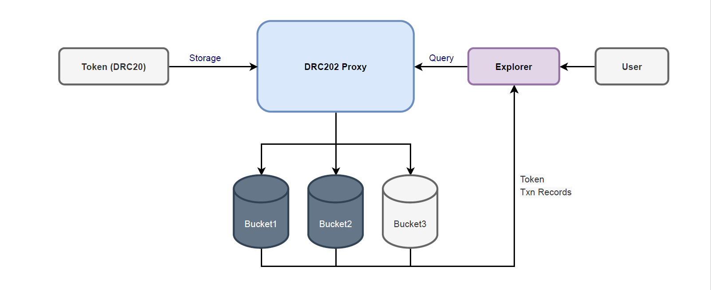

# ICTokens

**Website:** [http://ictokens.com](http://ictokens.com/)  
**Canister id:**  y2b5k-gqaaa-aaaak-aacqq-cai  
**ModuleHash:** fced8cdbafa0b0bbf7c57ab53c3493023b79c26e62e06dd5992104e3f29dfa7b

**Tokens Explorer**  
**ICHouse:** [http://ic.house/](http://ic.house/)   

## Overview

ICTokens is an Asset Tokenization Platform powered by ICLighthouse, with Tokens based on the [DRC20 standard](https://github.com/iclighthouse/DRC_standards/tree/main/DRC20 ). Founders can create tokens with one click and manage them. Users can get a list of recommended tokens sorted by score and `star` favourite tokens. ICTokens also provides a Token Browser [ICTokens Scan](http://scan.ictokens.com) based on [DRC202](https://github.com/iclighthouse/DRC_standards/tree/main/DRC202).

## How it works

A founder creates a token with one click through ICTokens, following the DRC20 standard, and he can gain control of that token. For each token created, 100 ICL is charged. ICTokens provides a UI to manage tokens.

The list of tokens is sorted by score, which is calculated based on the number of user stars and the platform's recommendation value.   
If a user wants to follow a token, he can click on the Star button to add the token to his follow list ( it is required to send 1 ICL).

ICHouse is a public token transaction records explorer that uses the DRC202 standard. ICHouse supports multi-token storage of transaction records as a solution for persisting historical data for tokens. The Proxy creates a Bucket according to the actual storage requirements (a new Bucket is created when one is full), then compresses the transaction records and stores them in the Bucket. The way to query a token transaction record is to first query the Proxy to find out which Bucket the record is stored in (using BloomFilter technology for routing), and then retrieve the transaction record data from the Bucket.

## Usage

### Create a token

**Step1:** Log in to the ICLighthouse home page and create or import an account. Click on the `ICTokens` button on the left menu to access the token management page. 

**Step2:** `Approve` to ICTokens canister xxx ICL (>100).

**Step3:** Fill in your token name, issue amount, etc., click create and wait for the token's canister id to be returned.

### Resources

**DRC20**: https://github.com/iclighthouse/DRC_standards/tree/main/DRC20

**DRC202**: https://github.com/iclighthouse/DRC_standards/tree/main/DRC202

